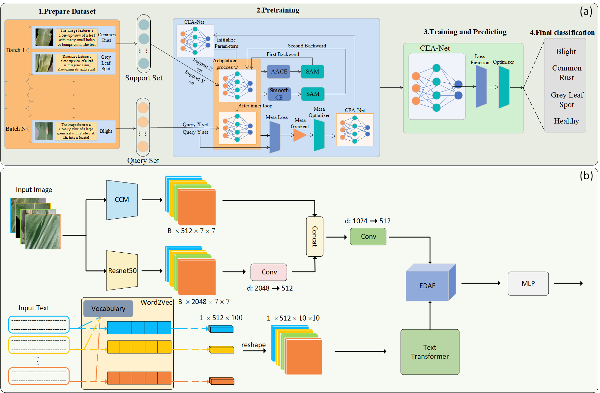

# CEA-Net: A Multi-modal Model For Corn Disease Classification With Dynamic Fusion And Cross-Layer Connection Mechanism

## 📰News

--[2025/12] all code has been released

--[2025/11] our code will be released in the near future

--[2025/11] 🥳our paper was accepted by 《Pattern Recognition》 

--[2025/06] create repository

--[2025/02] submit paper

## 📄Abstract

> Corn is one of the most widely cultivated crops globally, yet it remains highly susceptible to a variety of diseases. With the rapid advancement of deep learning, image-based methods for corn disease classification have emerged and achieved promising results. However, many existing approaches still face challenges such as reliance on single-source information and limited feature extraction capacity. To address these issues, this paper proposes a multi-modal model named CEA-Net. First, we introduce a Cross-layer Connection Model (CCM) for image processing, which integrates multi-level wavelet blocks, VMamba, and Transformer components through a cross-layer connectivity mechanism. This design enhances spatial information reorganization and facilitates efficient feature extraction and reuse within the visual backbone network. Second, we propose an Efficient Dynamic Attention Fusion (EDAF) module for multi-modal feature fusion. EDAF dynamically modulates the contribution of each modality, emphasizing dominant sources while efficiently enhancing the representational capability of feature maps. Finally, we introduce Adaptive Adversarial Cross-Entropy Meta-learning (AACEM) for model pre-training. By combining meta learning with sharpness-aware minimization and utilizing adaptive adversarial cross entropy loss, AACEM improves both generalization and overall performance. Experimental results show that CEA-Net achieves an accuracy of 97.40%, outperforming networks such as EfficientViM and D2R by margins of 0.81%, 0.56%, 0.67%, and 0.55% across various metrics, demonstrating its significant practical value in corn disease management. Our code and dataset are available at: https://github.com/yiyuynanodesu/CEA-Net

## 🔎Method Overview



## 🔧How To Use
### 1.Clone this repo
```bash
git clone https://github.com/yiyuynanodesu/CEA-Net.git
cd CEA-Net
```
### 2.Prepare Dataset
The dataset we used in our paper is now open source, you can download our dataset in [MCDD](https://github.com/yiyuynanodesu/Multimodal-Corn-Disease-Dataset) and put it in the **./dataset** directory. The file structure is as follows:
```bash
--dataset
    --MCDD
        --csv
            --test
            --train
        --dataf
            --test
            --train

```
### 3.Prepare Enviroment
Our model is based on **PyTorch2.3.0 Python3.12 ubuntu22.04 CUDA  12.1**
```bash
conda create -n cea-net python=3.12
conda activate cea-net
pip install -r requirement.txt
```

### 4.Prepare Pre-traind Weights
We will announce the pre-training weights shortly

### 5.Train and Inference
You can use the `MultimodalMain.ipynb` to train model and inference, pay attention to `line:`, `line:` and ``, the path for pretrain weight and dataset, here you can choose whether to pre-train
```python
# main
if __name__ == "__main__":
    if do_train:
        preTrain()
        train()
    
    if do_test:
        if config.load_model_path is None and not do_train:
            print('Please enter the path load_model_path of the trained model or choose to add do_train arg')
        else:
            test()
```

## Acknowledgement：
Our code is inseparable from the following authors' works. If our repo is helpful to you, please also take a look at the excellent works of these authors and give them a star✨:
[Sparx](https://github.com/LMMMEng/SparX.git)
[WaveMix](https://github.com/pranavphoenix/WaveMix)
[AACE](https://github.com/T-Ratchatorn/AACE.git)
[KuDA](https://github.com/MKMaS-GUET/KuDA)

## 🎓Cite Our Work

Our paper is in production...

## 🤝Contact

> Please feel free to contact: `wanghy2022@csuft.edu.cn`. We are very pleased to communicate with you and will maintain this repository during our free time.