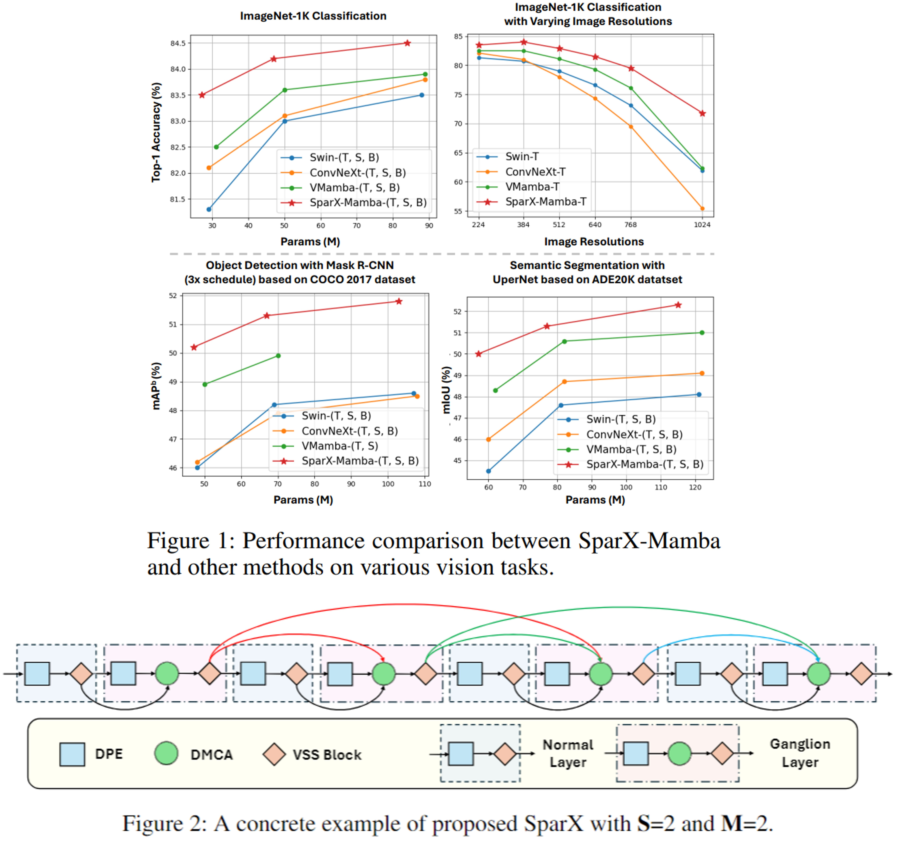

# [AAAI 2025] SparX: A Sparse Cross-Layer Connection Mechanism for Hierarchical Vision Mamba and Transformer Networks

This is an official PyTorch implementation of "[SparX: A Sparse Cross-Layer Connection Mechanism for Hierarchical Vision Mamba and Transformer Networks](https://arxiv.org/abs/2409.09649)".

# Introduction
```SparX``` is a new sparse cross-layer connection mechanism to effectively improve cross-layer feature interaction and reuse in vision backbone networks.
<center> 

</center>

# Image Classification

## 1. Requirements
We highly suggest using our provided dependencies to ensure reproducibility:
```
# Environments:
cuda==12.1
python==3.10
# Packages:
torch==2.3.1
timm==0.6.12
# Other Dependencies:
cd kernels/selective_scan && pip install .
```
## 2. Data Preparation
Prepare [ImageNet](https://image-net.org/) with the following folder structure, you can extract ImageNet by this [script](https://gist.github.com/BIGBALLON/8a71d225eff18d88e469e6ea9b39cef4).

```
│imagenet/
├──train/
│  ├── n01440764
│  │   ├── n01440764_10026.JPEG
│  │   ├── n01440764_10027.JPEG
│  │   ├── ......
│  ├── ......
├──val/
│  ├── n01440764
│  │   ├── ILSVRC2012_val_00000293.JPEG
│  │   ├── ILSVRC2012_val_00002138.JPEG
│  │   ├── ......
│  ├── ......
```

## 3. Main Results on ImageNet-1K with Pretrained Models

| Models      | Input Size | FLOPs (G) | Params (M) | Top-1 (%) | Download |
|:-----------:|:----------:|:---------:|:----------:|:----------:|:----------:|
| SparX-Mamba-T | 224x224    | 5.2       | 25       | 83.5       | [model](https://github.com/LMMMEng/SparX/releases/download/v1/sparx_mamba_tiny_in1k.pth)     |
| SparX-Mamba-S | 224x224    | 9.3       | 47      | 84.2       | [model](https://github.com/LMMMEng/SparX/releases/download/v1/sparx_mamba_small_in1k.pth)     |
| SparX-Mamba-B | 224x224    | 15.9       | 84       | 84.5       | [model](https://github.com/LMMMEng/SparX/releases/download/v1/sparx_mamba_base_in1k.pth)     |

## 4. Train
To train ```SparX-Mamba``` models on ImageNet-1K with 8 gpus (single node), run:
```
bash scripts/train_sparx_mamba_t.sh # train SparX-Mamba-T
bash scripts/train_sparx_mamba_s.sh # train SparX-Mamba-S
bash scripts/train_sparx_mamba_b.sh # train SparX-Mamba-B
```

## 5. Validation
To evaluate ```SparX-Mamba``` on ImageNet-1K, run:
```
MODEL=sparx_mamba_t # sparx_mamba_{t, s, b}
python3 validate.py \
/path/to/imagenet \
--model $MODEL -b 128 \
--pretrained # or --checkpoint /path/to/checkpoint 
```


# Citation
If you find this project useful for your research, please consider citing:
```
@article{lou2024sparx,
  title={SparX: A Sparse Cross-Layer Connection Mechanism for Hierarchical Vision Mamba and Transformer Networks},
  author={Lou, Meng and Fu, Yunxiang and Yu, Yizhou},
  journal={arXiv preprint arXiv:2409.09649},
  year={2024}
}
```

# Acknowledgment
Our implementation is mainly based on the following codebases. We gratefully thank the authors for their wonderful works.
> [timm](https://github.com/rwightman/pytorch-image-models)   
> [mmdet](https://github.com/open-mmlab/mmdetection)     
> [mmseg](https://github.com/open-mmlab/mmsegmentation)   
> [VMamba](https://github.com/MzeroMiko/VMamba)  

# Contact
If you have any questions, please feel free to [create issues](https://github.com/LMMMEng/SparX/issues) or [contact me](lmzmm.0921@gmail.com).
